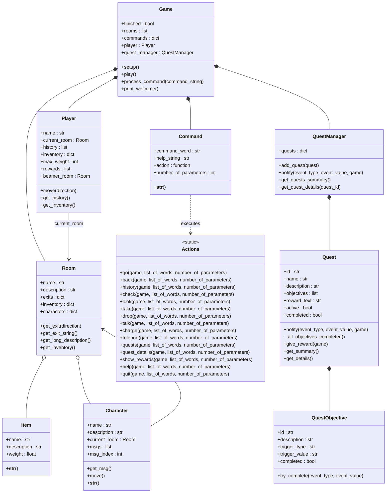

# Aventure à Brumeval

Bienvenue dans **Aventure à Brumeval**, un jeu d'aventure textuel (Text-Based Adventure) développé en Python. Plongez dans un univers mystérieux où une corruption ancienne ronge la nature et incarnez le héros qui tentera de sauver la forêt.

---

##  Guide Utilisateur

### 1. Installation et Lancement
Ce jeu ne nécessite aucune librairie externe complexe, uniquement une installation standard de Python 3.

**Prérequis :**
* Python 3.x installé sur votre machine.
* Les fichiers sources du projet dans un même dossier (`game.py`, `player.py`, `room.py`, `item.py`, `character.py`, `command.py`, `actions.py`, `quest.py`, `win.py`).

**Lancement :**
1.  Ouvrez votre terminal ou invite de commandes.
2.  Naviguez vers le dossier du projet.
3.  Lancez le jeu avec la commande :
    ```bash
    python game.py
    ```
    *(ou `python3 game.py` selon votre système)*

### 2. Description de l'Univers
L'histoire se déroule autour du **Village de Brumeval**, un lieu autrefois paisible, aujourd'hui désert et menacé par une "Corruption" émanant des profondeurs.

Le monde est composé de **8 lieux principaux** à explorer :

1.  **Village de Brumeval** : Le point de départ, un village fantôme avec une fontaine asséchée.
2.  **Ferme abandonnée** : Un lieu délabré où le vent fait claquer les portes et où traînent de vieux outils.
3.  **Forêt de Brume** : Le cœur de la région, noyé dans une brume étrange et inquiétante.
4.  **Lisière Est** : Une zone où la végétation (fougères rabougries) témoigne de la maladie de la terre.
5.  **Lisière Ouest** : Un endroit sinistre tapissé d'insectes morts.
6.  **Clairière corrompue** : Le centre du mal, dominé par un immense arbre noirci.
7.  **Sanctuaire ancien** : Un lieu de pierre couvert de mousse, gravé de symboles oubliés.
8.  **Tombeau souterrain** : Des profondeurs humides éclairées par une lueur verte, abritant un autel brisé.

Vous rencontrerez des personnages clés (l'Herboriste, le Forgeron, l'Esprit de la forêt) qui vous guideront dans votre quête.

### 3. Conditions de Victoire
Votre objectif ultime est de **purifier la forêt**. Pour cela, vous devrez accomplir une série de quêtes principales :
1.  **L'origine du mal** : Enquêter pour comprendre ce qui arrive à Brumeval.
2.  **L'arme des anciens** : Trouver les composants pour reforger la "Lame purificatrice".
3.  **Le scellement** : Pénétrer dans le Tombeau souterrain avec les artefacts sacrés (Lame et Graine) pour sceller la faille.

La victoire est déclenchée lorsque vous entrez dans le Tombeau avec les conditions requises remplies. Il n'y a pas de "Game Over" strict (mort du joueur), mais vous pouvez être bloqué si vous ne trouvez pas les objets nécessaires.

### 4. Commandes du Jeu
Le jeu se joue au clavier. Une invite `>` attend vos instructions. Voici les commandes disponibles :

####  Déplacements
* `go <N/S/E/O/U/D>` : Se déplacer vers le Nord, Sud, Est, Ouest, Haut (Up) ou Bas (Down).
* `back` : Revenir à la pièce précédente.
* `teleport` : Se téléporter vers la salle mémorisée par le *beamer*.

####  Actions & Inventaire
* `look` : Regarder autour de soi (affiche la description, les objets et les personnages).
* `take <objet>` : Ramasser un objet (attention au poids limite de 10kg !).
* `drop <objet>` : Poser un objet au sol.
* `check` : Afficher le contenu de votre inventaire.
* `charge` : Charger le *beamer* magique avec la position actuelle.

####  Interactions & Quêtes
* `talk <personnage>` : Parler à un PNJ (ex: `talk herboriste`).
* `quests` : Lister les quêtes actives et leur état.
* `quest <id>` : Afficher les détails d'une quête spécifique.
* `rewards` : Voir les récompenses obtenues.

####  Système
* `history` : Afficher l'historique des lieux visités.
* `help` : Afficher l'aide globale.
* `quit` : Quitter le jeu.

---

##  Guide Développeur

Le projet est conçu de manière modulaire en utilisant la Programmation Orientée Objet (POO).

### Architecture

* **`Game`** (`game.py`) : Classe centrale. Elle initialise le jeu (création des lieux, items, PNJ), gère la boucle principale (`play`) et le traitement des entrées utilisateur.
* **`Player`** (`player.py`) : Représente le joueur. Gère sa position actuelle, son inventaire, son poids transporté et l'historique de ses déplacements.
* **`Room`** (`room.py`) : Représente un lieu du jeu. Contient sa description, ses sorties (liens vers d'autres `Room`), ainsi que les objets (`Item`) et personnages (`Character`) présents.
* **`Item`** (`item.py`) : Représente un objet pouvant être ramassé. Définit un nom, une description et un poids.
* **`Character`** (`character.py`) : Représente un personnage non-joueur (PNJ). Gère ses dialogues et ses déplacements aléatoires.
* **`Command`** (`command.py`) : Structure une commande de jeu (mot-clé, fonction associée, nombre de paramètres).
* **`Actions`** (`actions.py`) : Regroupe les fonctions statiques exécutées par les commandes (ex: `go`, `take`, `talk`, `quit`...). C'est le "moteur" des interactions.
* **`QuestManager`**, **`Quest`**, **`QuestObjective`** (`quest.py`) : Système de gestion des quêtes.
    * `QuestManager` stocke et suit l'état des quêtes.
    * `Quest` définit une mission et sa récompense.
    * `QuestObjective` définit les conditions individuelles de réussite (trigger).

### Diagramme de Classes
Voici la structure des classes générée avec **Mermaid** :



##  Perspectives de Développement

Voici les pistes d'amélioration et les fonctionnalités futures envisagées pour enrichir l'expérience de jeu :

1.  **Système de Combat**
    * Ajouter des points de vie (HP) au joueur et aux personnages.
    * Implémenter des mécaniques d'attaque et de défense.
    * Introduire des monstres hostiles dans les zones dangereuses (comme le Tombeau) pour rendre l'exploration plus périlleuse.

3.  **Interface Graphique (GUI)**
    * Remplacer la console textuelle par une interface fenêtrée (utilisant `Tkinter`).
    * Afficher des illustrations pour chaque lieu, une carte interactive et des boutons pour les actions courantes.
